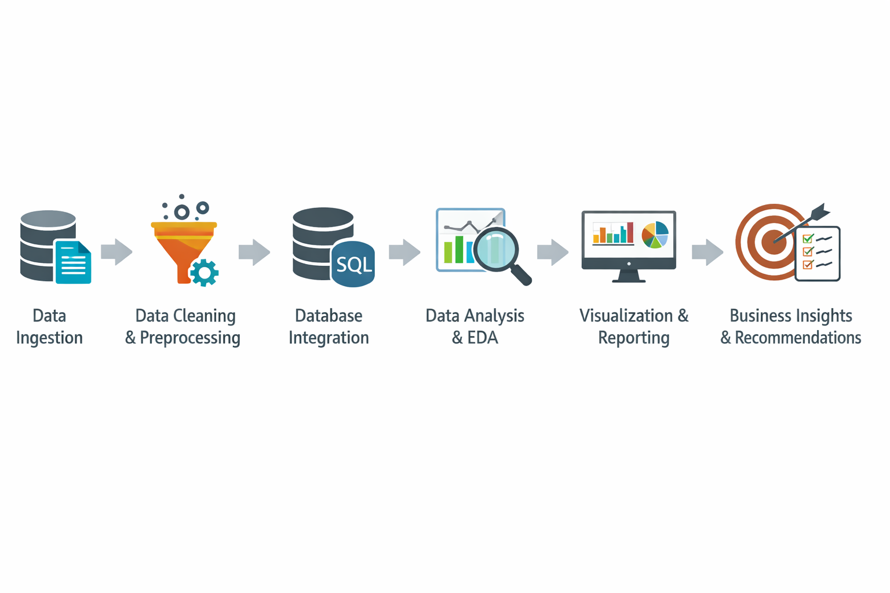

# End-to-End Data Analytics Pipeline Using SQL, Python, and Power BI

## 📌 Project Overview

This project demonstrates a complete end-to-end data analytics pipeline, transforming raw data into meaningful business insights. The objective of the project is to clean, process, analyze, and visualize sales and vendor performance data to support data-driven decision-making.

The workflow covers the entire analytics lifecycle, including data ingestion, database integration, SQL-based processing, Python-driven data cleaning and exploratory analysis, and business intelligence reporting using Power BI. Technologies such as SQLite, SQL, Python (Pandas, Matplotlib, Seaborn), and DAX are integrated to build a scalable and structured analytics solution.

This project highlights practical skills in data engineering, exploratory data analysis (EDA), statistical reasoning, and dashboard development, making it suitable for real-world business intelligence and analytics use cases.

## 📊 Power BI Dashboard Preview

> Power BI dashboard showcasing sales, profit, inventory turnover,
> and vendor performance insights.

## 🧩 Data Analytics Pipeline

## 🛠️ Tools & Technologies Used

- **Database:** SQLite  
- **Query Language:** SQL  
- **Programming Language:** Python  
  - Pandas (data manipulation)
  - NumPy (numerical operations)
- **Data Visualization:**  
  - Matplotlib  
  - Seaborn  
- **Business Intelligence Tool:** Power BI  
- **Analytics & Modeling Language:** DAX  
- **Development Environment:** Jupyter Notebook  
- **Version Control:** Git & GitHub
## 🔄 Project Workflow

1. **Data Collection**
   - Downloaded the raw dataset from a publicly available external source for educational and analytical purposes.

2. **Initial Data Exploration**
   - Performed a preliminary review of the raw data to understand structure, data types, and key metrics.

3. **Database Integration**
   - Loaded the raw data into an **SQLite database**.
   - Retrieved data using **SQL queries** for structured preprocessing.

4. **Data Cleaning & Processing (Python)**
   - Processed the data in **Jupyter Notebook** using Python.
   - Handled missing and inconsistent values.
   - Standardized numerical and categorical columns.
   - Filtered records with zero or negative profit and zero sales quantity.

5. **Processed Data Storage**
   - Stored the cleaned and transformed data in a new table within the SQLite database.

6. **Data Modeling & Analysis**
   - Created new DataFrames by joining multiple tables.
   - Engineered key metrics such as **Gross Profit**, **Profit Margin**, **Stock Turnover**, and **Inventory Capital**.

7. **Exploratory Data Analysis (EDA)**
   - Built visualizations using **Matplotlib** and **Seaborn** to identify trends, outliers, and correlations.

8. **Business Intelligence & Reporting**
   - Loaded the processed data into **Power BI**.
   - Created calculated tables and measures using **DAX**.
   - Designed interactive dashboards to support data-driven decision-making.
  ## 📂 Repository Structure

This repository contains all project components required to understand, reproduce, and evaluate the end-to-end data analytics pipeline.

- **[data/processed](data/processed)**  
  - Contains the cleaned and standardized dataset generated after data preprocessing.

- **[notebooks](notebooks)**  
  - Jupyter Notebooks used for data cleaning, transformation, exploratory data analysis (EDA), and visualization.

- **[outputs/figures](outputs/figures)**  
  - Visual outputs created using **Matplotlib** and **Seaborn** during exploratory data analysis.

- **[powerbi_dashboard](powerbi_dashboard)**  
  - Image of the final Power BI dashboard showcasing key business insights and KPIs.

- **[report](report)**  
  - Project report documenting exploratory data analysis, statistical findings, insights, and business recommendations.

- **[src](src)**  
  - Python scripts for data ingestion, data cleaning, transformation, and database operations.
 ## 🧮 DAX Calculations (Power BI)

DAX (Data Analysis Expressions) was used in Power BI to create calculated tables that enable advanced vendor, brand, and inventory performance analysis without modifying the source data.

- **Brand Performance Analysis:** Aggregated total sales and average profit margin at the brand level to evaluate revenue contribution and profitability.
- **Low Inventory Turnover Identification:** Identified vendors with low stock turnover to highlight slow-moving inventory and operational inefficiencies.
- **Vendor Purchase Contribution:** Calculated total purchase value per vendor to assess supplier dependency and concentration risk.
- **Top Vendor Analysis:** Filtered and analyzed top vendors by purchase rank to support strategic sourcing and risk management.

These DAX calculations power key dashboard KPIs such as **Total Sales, Total Purchase, Gross Profit, Profit Margin, Unsold Inventory Capital**, and **Top Vendors/Brands by Sales**, enabling interactive and insight-driven business intelligence reporting.

## 📊 Key Analysis & Insights

- **Negative and Zero Profit Transactions**
  - Identified transactions with negative or zero gross profit and profit margins, indicating losses caused by high costs, heavy discounts, or unsold inventory.
  - These records were filtered out to ensure reliable and meaningful analysis.

- **Outliers in Pricing and Logistics Costs**
  - Detected significant outliers in purchase price, actual price, and freight costs.
  - Freight costs showed extreme variation, highlighting potential logistics inefficiencies or inconsistent shipping strategies.

- **Inventory Performance and Stock Turnover**
  - Strong correlation (≈ 0.999) between total purchase quantity and total sales quantity indicates efficient inventory movement.
  - However, several products exhibited zero sales despite being purchased, pointing to slow-moving or obsolete inventory.
  - Total unsold inventory capital was estimated at approximately **$2.71M**, impacting cash flow and storage efficiency.

- **Vendor Contribution Analysis**
  - The top 10 vendors accounted for nearly **65.7% of total purchases**, revealing a heavy dependency on a limited number of suppliers.
  - This concentration introduces potential supply chain risks and highlights the need for vendor diversification.

- **Impact of Bulk Purchasing**
  - Vendors purchasing in bulk achieved nearly **72% lower unit costs** compared to smaller orders.
  - Bulk purchasing emerged as a key driver for maintaining profitability while increasing sales volume.

- **Profit Margin vs. Sales Performance**
  - Low-performing vendors exhibited higher profit margins but lower sales volumes.
  - High-performing vendors achieved greater sales volume but operated on relatively lower margins, suggesting different profitability models.

## 📌 Business Recommendations

- **Optimize Pricing for Low-Sales, High-Margin Vendors**
  - Adjust pricing strategies to improve sales volume without significantly compromising profitability.
  - Use targeted promotions and discounts to increase market reach.

- **Diversify Vendor Partnerships**
  - Reduce dependency on a small group of vendors to mitigate supply chain risks.
  - Onboard additional vendors to improve sourcing flexibility and resilience.

- **Leverage Bulk Purchasing Strategies**
  - Continue and expand bulk purchasing where feasible to benefit from lower unit costs.
  - Align bulk purchase decisions with demand forecasts to avoid excess inventory.

- **Improve Inventory Management**
  - Identify slow-moving and obsolete inventory early.
  - Optimize purchase quantities, introduce clearance sales, and revise storage strategies to reduce holding costs.

- **Enhance Marketing and Distribution for Underperforming Vendors**
  - Strengthen marketing campaigns and improve distribution channels for vendors with low sales volumes.
  - Focus on data-driven demand planning to increase overall sales performance.

By implementing these recommendations, organizations can improve profitability, reduce operational risks, and achieve more efficient inventory and vendor management.

## 🎯 Project Outcome & Key Learnings

- Successfully built a **complete end-to-end data analytics pipeline**, starting from raw data ingestion to business-ready reporting.
- Gained hands-on experience in **data cleaning, standardization, and feature engineering** using Python.
- Strengthened SQL skills by integrating and querying data from an **SQLite database**.
- Performed exploratory data analysis (EDA) to identify trends, outliers, correlations, and inefficiencies in sales and inventory data.
- Translated analytical findings into **actionable business recommendations** focused on profitability, inventory optimization, and vendor management.
- Improved understanding of how data processing, analysis, and visualization work together in real-world analytics projects.

This project demonstrates the ability to manage the **full analytics lifecycle** and deliver insights that support data-driven decision-making.

## 🧾 Conclusion

This project demonstrates a complete and structured approach to data analytics, covering data ingestion, processing, analysis, and reporting. By integrating Python, SQL, and Power BI, the project highlights how raw data can be transformed into actionable business insights. The outcomes emphasize the importance of data quality, analytical thinking, and clear communication in supporting informed decision-making.

